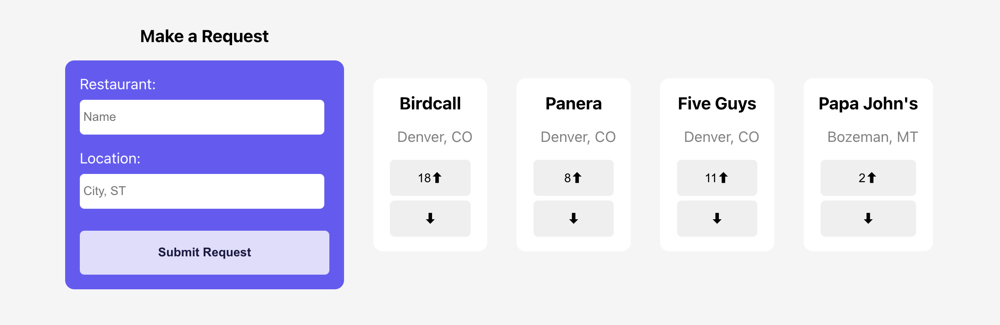

# Phase 3 Project Frontend (React App)

- This small full-stack application interacts with APIs from[phase-3-sinatra-react-project] to perform multiple different CRUD actions.

- The frontend uses proper frontend state management and updates state according to POST, PATCH, and DELETE requests. Each model has seperate classes and creates instances and class methods as necessary with OO design patterns.

- Routes in frontend and backend follow RESTful conventions.

## **The Feedplan mini app:**

This mini app is based on the Feedplan Restaurant Subscription App, it features two main sections that relate to the Feedplan mobile app:

**Restaurant Requests**, where users can add and vote on restaurants they would like to be able to purchase meal plans from in their area.

- If a user submits a restaurant reuqest that already exists, there is an alert that pops up and haults any duplicate posts. When a user submits a valid/unique request, a single upvote is given simultaneously.
- Users can upvote and downvote any restaurant request, a downvote simply removes the first upvote from the database, and the upvote number is rerendered.
- If the upvote count for a particular request drops below 1 , the request is removed from the database.

  

**Active Restaurants**, that are currently featured on the Feedplan mobile app and showcases their available meal plans, subscriber counts, location, and additional info all fetched from backend API.

- When a user subscribes to a particular meal plan associated with a restaurant, the total subscriber count for the restaurant increases by 1.
- Each meal plan for each restaurant has an associated # number subscribers, and only the total for the restaurant is shown. Each Active Restaurant Card is rendered from data received from the Sinatra API.

  

For more information on (the real) Feedplan App, check out the [Feedplan website](https://www.feedplan.io/).

Created by **[Win Feigle](linkedin.com/in/feigle)**
